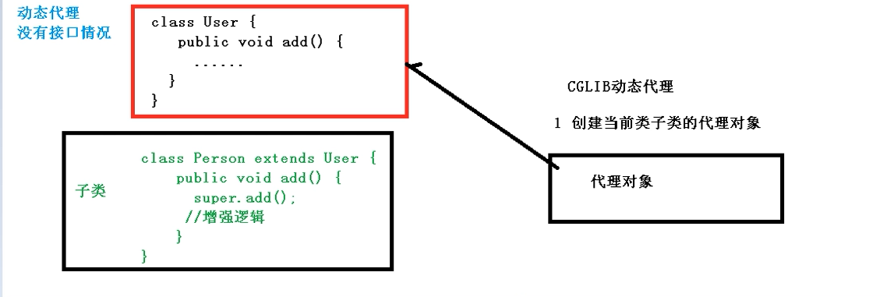

# Spring

## 1.快速使用Spring

​	1.创建一个maven工程，里面再创建一个web工程用来做spirng的测试。


​	2.创建包和文件夹java、resource


3.在Pom文件导入spirng坐标

```xml
    <dependency>
      <groupId>org.springframework</groupId>
      <artifactId>spring-context</artifactId>
      <version>5.1.9.RELEASE</version>
    </dependency>
```

4.在dao包中创建一个产品类

```Java
package com.wenwen.dao;

public class Product {
    public void add(){
        System.out.println("正在添加产品.....");
    }
}
```

5.创建一个bean.xml文件，即是spirng配置文件

```xml
<?xml version="1.0" encoding="UTF-8"?>
<beans xmlns="http://www.springframework.org/schema/beans"
       xmlns:xsi="http://www.w3.org/2001/XMLSchema-instance"
       xsi:schemaLocation="http://www.springframework.org/schema/beans http://www.springframework.org/schema/beans/spring-beans.xsd">
       
    <bean id="product" class="com.wenwen.dao.Product">
   	</bean>
</beans>
```

6.测试

```Java
package com.wenwen.test;
import com.wenwen.dao.Product;
import org.junit.Test;
import org.springframework.context.ApplicationContext;
import org.springframework.context.support.ClassPathXmlApplicationContext;

public class SprintTest {
    @Test
    public void test(){
        ApplicationContext applicationContext = new ClassPathXmlApplicationContext("classpath:bean.xml");
        Product product =  applicationContext.getBean("product",Product.class);
        product.add();
    }
}
```

## 2.IOC（概念和原理）

1.什么是IOC

- 控制反转，把对象创建和对象之间的调用过程，交给Spring进行管理
- 使用IOC目的：为了降低耦合度
- https://www.cnblogs.com/xdp-gacl/p/4249939.html SpringIOC的理解的Blog


2.ioc过程

第一步 xml配置文件，配置创建对象

```xml
<bean id="product" class="com.wenwen.dao.Product"/>
```

第二步 创建工厂类

```Java
package com.wenwen.factory;
import com.wenwen.dao.Product;

public class ProductFactory {
    public static Product getProduct(){
        String classVlue = class属性值; //1.xml解析获得
        Class clazz = Class.forName(classVlue); //2.通过反射创建对象
        return (Product) clazz.newInstance();

    }
}

```


3.IOC(接口)

1. IOC思想基于IOC容器完成,IOC容器底层就是对象工厂。

2. Spring提供IOC容器实现两种方式：（两个接口）

   - BeanFactory:IOC容器的基本实现，是Spring内部的使用接口，不提供给开发人员使用。

     加载配置文件的时候不会创建对象，在使用对象才去创建对象

   - ApplicationContext：BeanFactory接口的子接口，提供更多更强大的功能，一般由开发人员进行使用。

     配置文件里的对象会在加载配置文件的时候进行创建。

3. ApplicationContext接口有几个实现类。

```java
ApplicationContext applicationContext = 
    new FileSystemXmlApplicationContext("E:\\JavaWorkspace\\spring-demo\\spring-demo1\\src\\main\\resources\\bean.xml");//

ApplicationContext applicationContext = 
    new ClassPathXmlApplicationContext("classpath:bean.xml");

```

他们的实参不同。


## 3.IOC操作Bean管理（xml方式）

1.什么是Bean管理

- Bean管理指的是两个操作
- Spring创建对象
- Spring注入属性

2.Bean管理操作有两种方式

- 基于xml配置文件方式实现
- 基于注解方式实现


3.IOC操作Bean管理(基于xml方式)

### 1.**基于xml方式创建对象**

创建一个Book类

```Java
package com.wenwen.pojo;

public class Book {
    private String name;
    private String author;
    
     public Book() {
    }

    public Book(String name, String author) {
        this.name = name;
        this.author = author;
    }

    public void setName(String name) {
        this.name = name;
    }
    public void setAuthor(String author) {
        this.author = author;
    }
    @Override
    public String toString() {
        return "Book{" +
                "name='" + name + '\'' +
                ", author='" + author + '\'' +
                '}';
    }
}

```

在xml文件里注册bean

```xml
 <bean id="book" class="com.wenwen.pojo.Book"/>
```

1. 在spring配置文件中，使用bean标签，标签里添加对应属性，就可以实现对象创建。
2. 在bean标签里有很多属性，介绍常用属性
   - id属性：bean的唯一标识
   - class属性：类全路径（包类路径）
3. 创建对象的时候，默认是执行无参数构造方法


### **2.基于xml方式注入属性**

1. DI：依赖注入，就是注入属性

   第一种注入方式：使用set方法进行注入

   ```xml
   <bean id="book" class="com.wenwen.pojo.Book">
           <property name="author" value="金庸"/>
           <property name="name" value="天龙八部"/>
   </bean>
   ```

   编写测试代码

   ```java
   @Test
       public void testBook(){
           ApplicationContext applicationContext = 
           new ClassPathXmlApplicationContext("classpath:bean.xml");
           Book book =  applicationContext.getBean("book", Book.class);
           System.out.println(book);
       }
   ```

   运行结果为：

   

   

   第二种注入方式：执行有参数构造方法注入

   1. 创建类（拿上面创建的Book类），定义属性，创建属性对应有参数构造方法

   2. 在Spring配置文件中进行配置

      ```xml
      <bean id="book" class="com.wenwen.pojo.Book">
         <constructor-arg name="author" value="唐伯虎"/>
         <constructor-arg name="name" value="如何点秋香"/>
      </bean>
      ```

   第三种注入方式：p名称空间注入（了解）

   1. 使用p名称空间注入，可以简化基于xml配置方式

   添加p名称空间在配置文件中

   ```xml
   <?xml version="1.0" encoding="UTF-8"?>
   <beans xmlns="http://www.springframework.org/schema/beans"
          xmlns:xsi="http://www.w3.org/2001/XMLSchema-instance"
          xmlns:p="http://www.springframework.org/schema/p"
          xsi:schemaLocation="http://www.springframework.org/schema/beans http://www.springframework.org/schema/beans/spring-beans.xsd">
   
   ```

   进行属性注入，在bean标签里面进行操作

   ```xml
   <bean id="book" class="com.wenwen.pojo.Book" p:author="村上春树" p:name="且听风吟"  />
   ```

   

### 3.xml注入其他类型属性

**1.字面量**

- null值

```xml
<bean id="book" class="com.wenwen.pojo.Book">
   <property name="name" value="无字天书"/>
   <property name="author">
          <null/>
   </property>
</bean>
```


- 属性值包含特殊符号

```xml
//1.把<>进行转义 &lt;&gt;
//2.把带特殊符号内容写到CDATA
        <bean id="book" class="com.wenwen.pojo.Book">
            <property name="name" value="无字天书"/>
            <property name="author">
                <value><![CDATA[<<上帝>>]]></value>
            </property>
        </bean>
```


**2.注入外部bean**

1. 创建两个类service类和dao类

   ```Java
   package com.wenwen.service;
   import com.wenwen.dao.BookDao;
   
   public class BookService {
       private BookDao bookDao;
   
       public void setBookDao(BookDao bookDao) {
           this.bookDao = bookDao;
       }
   
       public void add(){
           bookDao.add();
       }
   }
   
   ```

   ```Java
   package com.wenwen.dao;
   
   public interface BookDao {
       public void add();
   }
   
   ```

   ```Java
   package com.wenwen.dao;
   
   public class BookDaoImpl implements BookDao{
       @Override
       public void add() {
           System.out.println("添加书籍。。。。");
       }
   }
   
   ```

   

2. 在service调用dao里面的方法

   ```Java
   package com.wenwen.service;
   import com.wenwen.dao.BookDao;
   
   public class BookService {
       private BookDao bookDao;
       public void setBookDao(BookDao bookDao) {
           this.bookDao = bookDao;
       }
       
       public void add(){
           bookDao.add();
       }
   }
   
   ```

   

3. 在spring配置文件中进行配置

```xml
<?xml version="1.0" encoding="UTF-8"?>
<beans xmlns="http://www.springframework.org/schema/beans"
       xmlns:xsi="http://www.w3.org/2001/XMLSchema-instance"
       xmlns:p="http://www.springframework.org/schema/p"
       xsi:schemaLocation="http://www.springframework.org/schema/beans http://www.springframework.org/schema/beans/spring-beans.xsd">

    <bean name="bookDao" class="com.wenwen.dao.BookDaoImpl"/>
    <bean name="bookService" class="com.wenwen.service.BookService">
        <property name="bookDao" ref="bookDao"/>
    </bean>
    
</beans>
```

4.测试

```Java
@Test
public void addBook(){
    ApplicationContext applicationContext = new ClassPathXmlApplicationContext("classpath:bean.xml");
    BookService bookService =  applicationContext.getBean("bookService", BookService.class);
    bookService.add();
}
```


**3.注入属性-内部bean和级联赋值**

1. 一对多关系：部门和员工

   一个部门有多个员工，一个员工属于一个部门，部门是一，员工是多。

2. 在实体类之间表示一对多关系，员工表示所属部门，是用对象类型属性进行。

下面两个实体类

```Java
package com.wenwen.bean;

//部门类
public class Dept {
    private String deptName;

    public void setDeptName(String deptName) {
        this.deptName = deptName;
    }
    
    @Override
    public String toString() {
        return "Dept{" +
                "deptName='" + deptName + '\'' +
                '}';
    }
}

```

```Java
package com.wenwen.bean;

//员工类
public class Emp {
    private String empName;
    private String gender;
    //员工属于某一个部门，使用对象形式表示
    private Dept dept;

    public void setDept(Dept dept) {
        this.dept = dept;
    }
    public void setEmpName(String empName) {
        this.empName = empName;
    }
    public void setGender(String gender) {
        this.gender = gender;
    }
    public void add(){
        System.out.println(empName+"::"+gender+"::"+dept);
    }
}
```

编写spring配置文件

```xml
<?xml version="1.0" encoding="UTF-8"?>
<beans xmlns="http://www.springframework.org/schema/beans"
       xmlns:xsi="http://www.w3.org/2001/XMLSchema-instance"
       xsi:schemaLocation="http://www.springframework.org/schema/beans http://www.springframework.org/schema/beans/spring-beans.xsd">

    <!--内部bean-->
    <bean id="emp" class="com.wenwen.bean.Emp">
        <property name="empName" value="小明"/>
        <property name="gender" value="男"/>
    <!--设置对象类型属性-->
        <property name="dept">
            <bean id="dept" class="com.wenwen.bean.Dept">
                <property name="deptname" value="篮球部"/>
            </bean>
        </property>
    </bean>
</beans>
```

测试

```java
@Test
public void bean(){
    ApplicationContext applicationContext = new ClassPathXmlApplicationContext("classpath:bean1.xml");
    Emp employee = applicationContext.getBean("emp", Emp.class);
    employee.add();
}
```

4.**级联赋值**

第一种写法

```xml
<bean id="emp" class="com.wenwen.bean.Emp">
    <property name="empName" value="小明"/>
    <property name="gender" value="男"/>
<!--设置对象类型属性-->
    <property name="dept" ref="dept"/>
</bean>
<bean id="dept" class="com.wenwen.bean.Dept">
    <property name="deptName" value="123123"/>
</bean>
```


第二种写法

```xml
<bean id="emp" class="com.wenwen.bean.Emp">
    <property name="empName" value="小明"/>
    <property name="gender" value="男"/>
<!--设置对象类型属性-->
    <property name="dept" ref="dept"/>
    <property name="dept.deptName" value="技术部"/> 
    //需要在emp pojo类中加入getDept方法获取对象
</bean>
<bean id="dept" class="com.wenwen.bean.Dept">
    <property name="deptName" value="123123"/>
</bean>
```


### 4.xml注入集合属性

1. 注入数组类型属性

2. 注入List集合类型属性

3. 注入Map集合类型属性

   （1）创建类，定义数组、list、map、set类型属性，生成对应set方法

   ```java
   public class Student {
       private String[] courses;
       private List<String> list;
       private Map<String,String> maps;
       private Set<String> sets;
   
       public void setCourses(String[] courses) {
           this.courses = courses;
       }
   
       public void setList(List<String> list) {
           this.list = list;
       }
   
       public void setMaps(Map<String, String> maps) {
           this.maps = maps;
       }
   
       public void setSets(Set<String> sets) {
           this.sets = sets;
       }
   }
   ```

   ​	（2）编写xml配置文件

```xml
<?xml version="1.0" encoding="UTF-8"?>
<beans xmlns="http://www.springframework.org/schema/beans"
       xmlns:xsi="http://www.w3.org/2001/XMLSchema-instance"
       xsi:schemaLocation="http://www.springframework.org/schema/beans http://www.springframework.org/schema/beans/spring-beans.xsd">

    <bean id="student" class="com.wenwen.pojo.Student">
        <property name="courses">
            <array>
                <value>java课程</value>
                <value>数据库课程</value>
            </array>
        </property>
        <property name="list">
            <list>
                <value>小明</value>
                <value>明明</value>
            </list>
        </property>
        <property name="maps">
            <map>
                <entry key="Java" value="java"></entry>
                <entry key="PHP" value="php"></entry>
            </map>
        </property>
        <property name="sets">
            <set>
                <value>MySQL</value>
                <value>Redis</value>
            </set>
        </property>
    </bean>
</beans>
```

4.在集合里面设置对象类型值

（1）创建课程类

```java
package com.wenwen.pojo;

public class Course {
    private String cname;//课程名称

    public void setCname(String cname) {
        this.cname = cname;
    }
}
```

(2)在Student类中加入课程列表属性和对应的set方法

```java
private List<Course> courseList;

public void setCourseList(List<Course> courseList) {
    this.courseList = courseList;
}
```

（3）编写配置文件

```xml
 <property name="courseList">
        <list>
            <ref bean="course1"></ref>
            <ref bean="course2"></ref>
        </list>
    </property>
</bean>
<bean id="course1" class="com.wenwen.pojo.Course">
    <property name="cname" value="语文课"/>
</bean>
<bean id="course2" class="com.wenwen.pojo.Course">
    <property name="cname" value="英语课"/>
</bean>
```

5.提取公共注入

（1）在配置文件名称空间中引入util

```xml
<?xml version="1.0" encoding="UTF-8"?>
<beans xmlns="http://www.springframework.org/schema/beans"
       xmlns:xsi="http://www.w3.org/2001/XMLSchema-instance"
       xmlns:util="http://www.springframework.org/schema/util"
       xsi:schemaLocation="http://www.springframework.org/schema/beans http://www.springframework.org/schema/beans/spring-beans.xsd
                        http://www.springframework.org/schema/util  http://www.springframework.org/schema/util/spring-util.xsd">
</beans>
```

（2）提取和注入

```xml
<!--       1. 提取list集合类型属性注入-->
    <util:list id="sportList">
        <value>FootBall</value>
        <value>BasketBall</value>
        <value>Swimming</value>
    </util:list>

<!--   2. 提取list集合类型属性注入使用-->
    <bean id="sport" class="com.wenwen.pojo.Sport">
        <property name="list" ref="sportList"/>
    </bean>
```


### 5.FactoryBean

1. Spring有两种类型，一种普通bean,另外一种工厂bean(FactoryBean)

2. 普通bean: 在配置文件中定义bean类型就是返回类型

3. 工厂bean: 在配置文件定义bean类型可以和返回类型不一样

   （1）创建类，让这个类作为工厂bean,实现接口`FactoryBean`,重写这个接口的方法

   ```java
   package com.wenwen.bean;
   import com.wenwen.pojo.Course;
   import com.wenwen.pojo.Sport;
   import org.springframework.beans.factory.FactoryBean;
   
   public class MyBean implements FactoryBean<Course> {
       //定义返回bean
       @Override
       public Course getObject() throws Exception {
           Course course = new Course();
           course.setCname("aaa123");
           return course;
       }
   
       @Override
       public Class<?> getObjectType() {
           return null;
       }
   
       @Override
       public boolean isSingleton() {
           return false;
       }
   }
   ```

   (2)编写xml配置文件

   ```XML
   <bean id="myBean" class="com.wenwen.bean.MyBean"/>
   ```


### 6.bean作用域

1. 在Spring里面，设置创建bean实例是单实例还是多实例

2. 在Spring里面，默认情况下，bean是单实例对象

3. 如何设置单实例还是多实例

   （1）在Spring配置文件bean标签里面有一个属性(`scope`)用于设置单实例还是多实例

   （2）`scope`属性值

   第一个值 默认值，`singleton`,表示是单实例对象

   第二个值 `prototype`，表示是多实例对象

   （3）singleton和prototype区别

   - singleton单实例，prototype多实例

   - 设置scope值是`singleton`时候，加载spring配置文件时候就会创建单实例对象

   - 设置scope值是`prototype`时候，不是在加载spring配置文件的时候创建对象，而是使用`getBean`方法

     的时候创建多实例对象


### 7.bean生命周期

1. 生命周期

   从对象创建到对象销毁的过程

2. bean生命周期 （五步）

   （1）通过构造器创建bean实例（无参数构造）

   （2）为bean的属性设置值和对其他bean引用（调用`set`方法）

   ​	(3) 调用bean的初始化的方法（需要进行配置初始化的方法）

   （4）bean可以使用了（对象获取到）

   （5）当容器关闭时，调用bean的销毁方法（需要进行配置销毁方法）

3. bean的后置处理器 （七步）

   （1）通过构造器创建bean实例（无参数构造）

   （2）为bean的属性设置值和对其他bean引用（调用`set`方法）

   **（3）把bean实例传递bean后置处理器的方法**

   `postProcessBeforeInitialization(Object bean, String beanName)`

   ​	(4) 调用bean的初始化的方法（需要进行配置初始化的方法）

   **（5）把bean实例传递bean后置处理器的方法**

   `postProcessAfterInitialization(Object bean, String beanName)`

   （6）bean可以使用了（对象获取到）

   （7）当容器关闭时，调用bean的销毁方法（需要进行配置销毁方法）

   

   4.添加后置处理器

   (1)创建类，实现接口BeanPostProcessor重写两个方法，创建后置处理器

   ```java
   package com.wenwen.bean;
   import org.springframework.beans.BeansException;
   import org.springframework.beans.factory.config.BeanPostProcessor;
   import org.springframework.lang.Nullable;
   
   public class MyBeanPost implements BeanPostProcessor {
       @Override
       public Object postProcessBeforeInitialization(Object bean, String beanName) throws BeansException {
           System.out.println("在初始化之前执行方法");
           return bean;
       }
   
       @Override
       public Object postProcessAfterInitialization(Object bean, String beanName) throws BeansException {
           System.out.println("在初始化之后执行方法");
           return bean;
       }
   }
   ```

   (2)在配置文件中注册这个bean

   ```xml
   <bean id="myBeanPost" class="com.wenwen.bean.MyBeanPost"/>
   ```

   在此文件中的所有Bean的生命周期都为七步

### 8.xml自动装配

1、什么是自动装配

（1）根据指定装配规则（属性名称或者属性类型），Spring自动将匹配的属性值进行注入

2、演示自动装配过程

（1）根据属性名称自动注入（`autowire="byName"`）

> BookService里面有一个叫做bookDao的属性

```xml
<bean name="bookDao" class="com.wenwen.dao.BookDaoImpl"/>
<bean name="bookService" class="com.wenwen.service.BookService" autowire="byName"/>
```

（2）根据属性类型自动注入（`autowire="byType"`）

```xml
    <bean id="bookDao" class="com.wenwen.dao.BookDaoImpl"/>
    <bean id="bookService" class="com.wenwen.service.BookService" autowire="byType"/>
```


### 9.引入外部属性文件

1. 直接配置数据库信息

   （1）配置druid连接池

   ```xml
   //直接配置连接池
   <bean id="dataSource" class="com.alibaba.druid.pool.DruidDataSource">
       <property name="driverClassName" value="com.mysql.jdbc.Driver"/>
       <property name="url" value="jdbc:mysql://localhost:3306/db_user"/>
       <property name="username" value="root"/>
       <property name="password" value="123456"/>
   </bean>
   ```

   （2）引入druid连接池依赖

   ```xml
   <dependency>
     <groupId>com.alibaba</groupId>
     <artifactId>druid</artifactId>
     <version>1.1.10</version>
   </dependency>
   
   //数据库驱动
   <dependency>
     <groupId>mysql</groupId>
     <artifactId>mysql-connector-java</artifactId>
     <version>5.1.47</version>
   </dependency>
   ```

2. 引入外部属性文件配置数据库连接池

   (1)在resource目录下编写`jdbc.properties`外部文件

   ```properties
   jdbc.driverClassName=com.mysql.jdbc.Driver
   jdbc.url=jdbc:mysql://localhost:3306/db_user
   jdbc.username=root
   jdbc.password=123456
   ```

   (2)在xml配置文件中引入`context`名称空间

   ```xml
   <?xml version="1.0" encoding="UTF-8"?>
   <beans xmlns="http://www.springframework.org/schema/beans"
          xmlns:xsi="http://www.w3.org/2001/XMLSchema-instance"
          xmlns:p="http://www.springframework.org/schema/p"
          xmlns:context="http://www.springframework.org/schema/context"
          xsi:schemaLocation="http://www.springframework.org/schema/beans 
          http://www.springframework.org/schema/beans/spring-beans.xsd
           http://www.springframework.org/schema/context/spring-context.xsd">
   ```

   (3)引入外部属性文件

   ```xml
   <context:property-placeholder location="classpath:jdbc.properties"/>
   ```

   （4）配置连接池

   使用`${}`表达式从配置文件中根据`key`获取`value`

   ```xml
   <bean id="dataSource" class="com.alibaba.druid.pool.DruidDataSource">
       <property name="driverClassName" value="${jdbc.driverClassName}"/>
       <property name="url" value="${jdbc.url}"/>
       <property name="username" value="${jdbc.username}"/>
       <property name="password" value="${jdbc.password}"/>
   </bean>
   ```


## 4.IOC操作Bean管理（注解方式）

### 1、什么是注解

（1）注解是代码特殊标记，格式：@注解名称（属性名称=属性值，属性名称=属性值..）

（2）使用注解，注解作用在类上面，方法上面，属性上面

（3）使用注解目的：简化xml配置

### 2、Spring针对Bean管理中创建对象提供注解

(1)`@Componet`

(2)`@Service`

(3)`@Controller`

(4)`@Repository`

> 上面四个注解功能都是一样的，都可以用来创建bean实例

### 3、基于注解方式实现对象创建

1. 引入依赖

   ```xml
   <dependency>
     <groupId>org.springframework</groupId>
     <artifactId>spring-aop</artifactId>
     <version>5.1.10.RELEASE</version>
   </dependency>
   ```

2. 开启组件扫描

   > 如果扫描多个包，多个包使用逗号隔开

   ```xml
   <?xml version="1.0" encoding="UTF-8"?>
   <beans xmlns="http://www.springframework.org/schema/beans"
          xmlns:xsi="http://www.w3.org/2001/XMLSchema-instance"
          xmlns:context="http://www.springframework.org/schema/context"
          xsi:schemaLocation="http://www.springframework.org/schema/beans
          http://www.springframework.org/schema/beans/spring-beans.xsd
          http://www.springframework.org/schema/context
           http://www.springframework.org/schema/context/spring-context.xsd">
   
           <context:component-scan base-package="com.wenwen.dao,com.wenwen.service"/>
   </beans>
   ```

3. 创建类，在类上面添加创建对象注解

   ```java
   package com.wenwen.service;
   import org.springframework.stereotype.Service;
   
   @Service(value = "userService") //<bean id="userService class="当前类的包名"/>
   public class UserService {
       public void add(){
           System.out.println("添加用户中。。。");
       }
   }
   ```

   > 在注解里面value属性值可以省略不写，默认是类名称首字母小写

4. 测试

   > 原理：读取配置文件的时候，根据组件扫描配置的包路径去查找包下的类，从而把里面标注了注解的内容进行对象的创建，放进IOC容器中。

   

组件扫描配置

```xml
<context:component-scan base-package="com.wenwen" use-default-filters="false">
        <context:include-filter type="annotation" 
                                expression="org.springframework.stereotype.Controller"/>
</context:component-scan>

<context:component-scan base-package="com.wenwen">
        <context:exclude-filter type="annotation" 
                                expression="org.springframework.stereotype.Controller"/>
</context:component-scan>
```

> 说明：
>
> `use-default-filters="false"`表示不适用默认过滤器，自己定义过滤器
>
> `<context:include-filter`  表示只扫描包里标注了 Controller注解的类
>
> `<context:exclude-filter` 表示除了标注了Controller注解的类都进行扫描

### 4、基于注解方式实现属性注入

（1）`@Autowired`：根据属性类型进行自动装配

第一步把service和dao对象创建，在service和dao类添加创建对象注解（`@Service` `@Repository`）

第二步把service注入dao对象，在service类添加dao类型属性，在属性上面使用注解

（2）`@Qualifier`：根据名称进行注入

这个注解的使用，需要和上面`@Autowired`一起使用

（3）`@Resource`：可以根据类型注入，也可以根据名称注入

```java
@Resource（name=“xxxx”）//根据名称进行注入
    private UserDao userDao;
```

(4)`@Value`:注入普通类型属性

```java
@Value(value="xxx")
private String name;
```

### 5、完全注解开发

（1）创建配置类，替代xml配置文件

```java
package com.wenwen.config;
import org.springframework.context.annotation.ComponentScan;
import org.springframework.context.annotation.Configuration;

@Configuration
@ComponentScan(basePackages = {"com.wenwen.dao","com.wenwen.service"})//多个文件为数组形式
//xml文件<context:component-scan base-package="com.wenwen.dao,com.wenwen.service"/>
public class MyConfig {

}
```

（2）编写测试类

```java
@Test
public void testService1(){
    ApplicationContext applicationContext = new AnnotationConfigApplicationContext(MyConfig.class);//改变的地方
    UserService userService = applicationContext.getBean("userService",UserService.class);
    userService.add();

}
```

## 5.Aop

### 1、什么是AOP

（1）面向切面编程，利用AOP可以对业务逻辑的各个部分进行隔离，从而使得业务逻辑各部分之间

的耦合度降低，提高程序的可重用性，同时提高了开发的效率。

（2）通俗描述：不通过修改源代码方式，在主干功能里面添加新功能

（3）使用登录例子说明AOP


### 2、底层原理

1. AOP底层使用动态代理

   有两种情况动态代理

   （1）有接口情况，使用JDK动态代理

   创建接口实现类代理对象，增强类的方法


（2）没有接口情况，使用CGLIB动态代理

创建子类的代理对象，增强类的方法



### 3、JDK动态代理

java.lang.reflect.Proxy

1.调用`newProxyInstance`方法

```java
public static Object newProxyInstance(ClassLoader loader,
                                          Class<?>[] interfaces,
                                          InvocationHandler h)
```

方法有三个参数：

第一个参数：类加载器

第二个参数：增强方法所在的类，这个类实现的接口，支持多个接口

第三个参数：实现这个接口`InvocationHandler`，创建代理对象，写增强的部分

2.编写JDK动态代理代码

（1）创建接口，定义方法

```java
package com.wenwen.dao;

public interface UserDao {
    public int add(int i ,int j);
    public String update(String id);
}
```

（2）创建接口实现类，实现方法

```java
package com.wenwen.dao;

public class UserDaoImpl implements UserDao{
    @Override
    public int add(int i, int j) {
        System.out.println("add方法执行了");
        return i+j;

    }

    @Override
    public String update(String id) {
        System.out.println("update方法执行了");
        return id;
    }
}
```

（3）使用Proxy类创建接口代理对象

```java
package com.wenwen.dao;

import java.lang.reflect.InvocationHandler;
import java.lang.reflect.Method;
import java.lang.reflect.Proxy;
import java.util.Arrays;

public class JDKProxy {
    public static void main(String[] args) {
        //创建接口实现类代理对象
        Class[] interfaces = {UserDao.class};
        UserDaoImpl userDao = new UserDaoImpl();
        UserDao dao = (UserDao) Proxy.newProxyInstance(JDKProxy.class.getClassLoader(), interfaces, new UserDaoProxy(userDao));
        int result = dao.add(1,2);
        System.out.println("result:"+result);
    }
}

//创建代理对象代码
class UserDaoProxy implements InvocationHandler{

    //1.把创建的是谁的代理对象，把谁传过来
    //有参数构造传递
    private Object obj;
    public UserDaoProxy(Object obj){
        this.obj = obj;
    }
    //增强的逻辑
    @Override
    public Object invoke(Object proxy, Method method, Object[] args) throws Throwable {
        //方法之前
        System.out.println("方法之前执行"+method.getName()+":传递的参数... "+ Arrays.toString(args));
        //被增强的方法执行
        Object res = method.invoke(obj,args);
        //方法之后
        System.out.println("方法之后执行"+obj);
        return res;
    }
}
```

### 4、AOP术语

1、连接点

​		类里面哪些方法可以被增强，这些方法称为连接点

2、切入点

​		实际被真正增强的方法，称为切入点

3、通知（增强） 

​		（1）实际增强的逻辑部分称为通知（增强）

​		（2）通知有多种类型

​			前置、后置、环绕、异常、最终通知

4、切面

> ​	是一个动作

​		（1）把通知应用到切入点过程

### 5、AOP操作（准备）

1、Spring框架一般都是基于AspectJ实现APO操作

​	什么是AspectJ？

> ​	AspectJ不是Spirng组成部分，独立AOP框架，一般把AspectJ和Spring框架
>
> 一起使用，进行AOP操作

2、基于AspectJ实现AOP操作

​	（1）基于xml配置文件实现

​	（2）基于注解方式实现（使用）

3、在项目工程里面引入AOP相关依赖

```xml
<dependency>
  <groupId>org.aspectj</groupId>
  <artifactId>aspectjweaver</artifactId>
  <version>1.9.4</version>
</dependency>
```

4、切入点表达式

（1）切入点表达式作用：知道对哪个类里面的哪个方法进行增强

（2）语法结构：

execution([权限修饰符] [返回类型] [类全路径] [方法名称] [参数列表])

例子一：对com.atguigu.dao.BookDao类里面的add进行增强

```java
execution(* com.atguigu.dao.BookDao.add(..))
```

例子二：对com.atguigu.dao.BookDao类里面的所有的方法进行增强

```java
execution(* com.atguigu.dao.BookDao.*(..))
```

例子三：对com.atguigu.dao包里面所有类，类里的所有方法进行增强

```java
execution(* com.atguigu.dao.*.*(..))
```

### 6、AspectJ注解

1. 创建类，在类里面定义方法

```java
package com.wenwen.aopano;

//被增强的类
public class User {
    public void add(){
        System.out.println("add....");
    }
}
```

2.创建增强类（编写增强罗家）

（1）在增强类里面，创建方法，让不同方法代表不同通知类型

```java
package com.wenwen.aopano;

//增强的类
public class UserProxy {
    //前置通知
    public void before(){
        System.out.println("before....");
    }
}
```

3.进行通知的配置

（1）在spring配置文件中，开启注解扫描

```xml
<?xml version="1.0" encoding="UTF-8"?>
<beans xmlns="http://www.springframework.org/schema/beans"
       xmlns:xsi="http://www.w3.org/2001/XMLSchema-instance"
       xmlns:context="http://www.springframework.org/schema/context"
       xmlns:aop="http://www.springframework.org/schema/aop"
       xsi:schemaLocation="http://www.springframework.org/schema/beans http://www.springframework.org/schema/beans/spring-beans.xsd
                            http://www.springframework.org/schema/context http://www.springframework.org/schema/context/spring-context.xsd
                            http://www.springframework.org/schema/aop http://www.springframework.org/schema/aop/spring-aop.xsd">

<!--        开启注解扫描-->
    <context:component-scan base-package="com.wenwen.aopano"/>
<!--    开启AspectJ生成代理对象-->
    <aop:aspectj-autoproxy></aop:aspectj-autoproxy>
</beans>
```

（2）使用注解创建User和UserProxy对象

```java
package com.wenwen.aopano;
import org.springframework.stereotype.Component;

//被增强的类
@Component
public class User {
    public void add(){
        System.out.println("add....");
    }
}
```

```java
package com.wenwen.aopano;
import org.springframework.stereotype.Component;
//增强的类
@Component
public class UserProxy {
    //前置通知
    public void before(){
        System.out.println("before....");
    }
}
```

（3）在增强类上面添加注解`@Aspect`

```java
@Aspect
public class UserProxy {
```

（4）在spring配置文件中开启生成代理对象

```xml
<!--    开启AspectJ生成代理对象-->
    <aop:aspectj-autoproxy></aop:aspectj-autoproxy>
```

4.配置不同类型的通知

（1）在增强类的里面，在作为通知方法上面添加通知类型注解，使用切入点表达式配置。

```java
//增强的类
@Component
@Aspect
public class UserProxy {
    //前置通知
    @Before(value = "execution(* com.wenwen.aopano.User.add(..))")
    public void before(){
        System.out.println("before....");
    }
    //环绕通知
    @Around(value = "execution(* com.wenwen.aopano.User.add(..))")
    public void around(ProceedingJoinPoint proceedingJoinPoint) throws Throwable{
        System.out.println("环绕之前。。。。");
        //被增强的方法执行
        proceedingJoinPoint.proceed();
        System.out.println("环绕之后。。。。");
    }
}

```

5.抽取相同切入点

```java
@Pointcut(value = "execution(* com.wenwen.aopano.User.add(..))")
public void pointdemo(){
}

//最终通知
@After(value = "pointdemo()")
public void after(){
     System.out.println("after....");
}

```

6.有多个增强类对同一个方法进行增强，设置增强类优先级

（1）在增强类上面添加注解`@Order`（数字类型），数字类型值越小优先级越高


## 6.JdbcTemplate

### 1、什么是JdbcTemplate

（1）Spring框架对JDBC进行封装，使用JdbcTemplate方便实现对数据库操作

### 2、准备工作

（1）导入依赖

```xml
<dependency>
  <groupId>org.springframework</groupId>
  <artifactId>spring-jdbc</artifactId>
  <version>5.2.6.RELEASE</version>
</dependency>
<dependency>
  <groupId>org.springframework</groupId>
  <artifactId>spring-orm</artifactId>
  <version>5.2.6.RELEASE</version>
</dependency>
<dependency>
  <groupId>org.springframework</groupId>
  <artifactId>spring-tx</artifactId>
  <version>5.2.6.RELEASE</version>
</dependency>
```

（2）在Spring配置文件配置数据库连接池

```xml
<bean id="dataSource" class="com.alibaba.druid.pool.DruidDataSource">
    <property name="driverClassName" value="${jdbc.driverClassName}"/>
    <property name="url" value="${jdbc.url}"/>
    <property name="username" value="${jdbc.username}"/>
    <property name="password" value="${jdbc.password}"/>
</bean>
```

```properties
jdbc.driverClassName=com.mysql.jdbc.Driver
jdbc.url=jdbc:mysql://localhost:3306/db_user
jdbc.username=root
jdbc.password=123456
```

（3）配置JdbcTemplate对象，注入DataSource

```xml
<bean id="jdbcTemplate" class="org.springframework.jdbc.core.JdbcTemplate">
<!--        注入dataSource-->
    <property name="dataSource" ref="dataSource"></property>
</bean>
```

（4）创建service类，创建dao类，在dao注入jdbcTemplate对象

- 在Spring配置文件中开启组件扫描

  ```xml
  <context:component-scan base-package="com.wenwen.jdbctemplate"/>
  ```

  

- 创建dao类

```java
@Repository
public class MyUserDaoImpl implements MyUserDao{
    @Autowired
    private JdbcTemplate jdbcTemplate;
}
```

- 创建service类

```java
@Service
public class UserService {
    //注入dao
    @Autowired
    private MyUserDao myUserDao;
}
```

### 3、JdbcTemplate操作数据库（添加、删除、修改、查询）

1、编写实体类--属性需要对应数据库字段

```java
package com.wenwen.jdbctemplate.entity;

public class User {
    private int id;
    private String username;
    private String password;
    private String email;

    public int getId() {
        return id;
    }

    public void setId(int id) {
        this.id = id;
    }

    public String getUsername() {
        return username;
    }

}
```

2、编写service和dao（添加）

（1）在dao接口进行数据库添加操作

```java
public interface MyUserDao {
    public void add(User user);
}
```

（2）调用JdbcTemplate对象里面update方法实现添加操作

```java
@Repository
public class MyUserDaoImpl implements MyUserDao{
    @Autowired
    private JdbcTemplate jdbcTemplate;

    @Override
    public void add(User user) {
        //1.创建sql语句
        String sql="insert into t_user values(?,?,?,?)";
        //2.调用方法实现
        Object[] args = {user.getId(),user.getUsername(),user.getEmail(),user.getPassword()};
        //也可以不用args存放参数
        int result = jdbcTemplate.update(sql,args);
        System.out.println(result);
    }
}
```

（3）进行测试

```java
@Test
public void testJdbcTemplate(){
    ApplicationContext applicationContext = new ClassPathXmlApplicationContext("classpath:bean.xml");
    UserService userService = applicationContext.getBean("userService",UserService.class);
    User user = new User();
    user.setUsername("sdsd");
    user.setPassword("123456");
    user.setEmail("502244635@qq.com");
    userService.add(user);

}
```

3、修改、删除

​		dao层

```java
public interface MyUserDao {
    public void add(User user);
    public void update(User user);
    public void delete(int id);
    
}
```

```java
    @Override
    public void update(User user) {
        String sql = "update t_user set username=?,password=? where id=?";
        Object[] args = {user.getUsername(),user.getPassword(),user.getId()};
        int result = jdbcTemplate.update(sql,args);
        System.out.println(result);
    }

    @Override
    public void delete(int id) {
        String sql = "delete from t_user where id=?";
        int result = jdbcTemplate.update(sql,id);
        System.out.println(result);
    }
}
```

​	service层

```java
public void update(User user){
    myUserDao.update(user);
}

public void delete(int id){
    myUserDao.delete(id);
}
```

​	测试

```java
@Test
public void testUpdate(){
    ApplicationContext applicationContext = new ClassPathXmlApplicationContext("classpath:bean.xml");
    UserService userService = applicationContext.getBean("userService",UserService.class);
    User user = new User();
    user.setUsername("修改咯");
    user.setPassword("修改123456");
    user.setId(21);
    userService.update(user);
}

@Test
public void testDelete(){
    ApplicationContext applicationContext = new ClassPathXmlApplicationContext("classpath:bean.xml");
    UserService userService = applicationContext.getBean("userService",UserService.class);
    userService.delete(22);
}
```

4、查询返回某个值

（1）查询表里面有多少条记录，返回是某个值


（2）使用JdbcTemplate实现查询返回某个值代码


- ​	第一个参数：sql语句
- 第二个参数：返回类型Class

```java
@Override
public int queryCount() {
    String sql = "select count(*) from t_user";
    int result = jdbcTemplate.queryForObject(sql,Integer.class);
    return result;
}
```

5、查询返回对象

（1）场景：查询图书详情

（2）JdbcTemplate实现查询返回对象

​	

- 第一个参数：sql语句
- 第二个参数：RowMapper是接口，针对返回不同类型数据，使用这个接口实现类去完成数据封装
- 第三个参数：sql语句里面的问号

```java
@Override
public User queryForOne(int id) {
    String sql = "select * from t_user where id=?";
    User user = jdbcTemplate.queryForObject(sql,new BeanPropertyRowMapper<User>(User.class),id);
    return user;
}
```

6、查询返回集合

(1)场景：查询图书列表分页

（2）JdbcTemplate方法实现返回集合

> ​		参数意思与返回对象一样


## 7.事务概念

### 1.概念

1. 什么是事务

（1）事务是数据库操作最基本单元，上一组操作，要么都成功，要么都失败，有一个失败也算失败

（2）典型场景：银行转账

​		a转账100元给b

​		a少100元  b多100元

​	2.事务四个特性（ACID ）

（1）原子性

要么都成功，要么都失败，不可分割。

（2）一致性

他们转账一共涉及两百元

（3）隔离性

多事务之间不会产生影响

（4）持久性

提交后，数据库表数据发生变化

### 2.搭建事务操作环境

1、创建数据库表，添加记录


2、创建service,搭建dao，完成对象创建和注入关系

（1）service注入dao，在dao注入JdbcTemplate，在JdbcTemplate注入datasource

`jdbc.properties`

```properties
jdbc.driverClassName=com.mysql.jdbc.Driver
jdbc.url=jdbc:mysql://localhost:3306/my_book?characterEncoding=utf8
jdbc.username=root
jdbc.password=123456
```

`bean.xml`

```xml
    <context:property-placeholder location="classpath:jdbc.properties"/>

    <context:component-scan base-package="com.wenwen.tx"/>

    <bean id="dataSource" class="com.alibaba.druid.pool.DruidDataSource">
        <property name="driverClassName" value="${jdbc.driverClassName}"/>
        <property name="url" value="${jdbc.url}"/>
        <property name="username" value="${jdbc.username}"/>
        <property name="password" value="${jdbc.password}"/>
    </bean>
    <bean id="jdbcTemplate" class="org.springframework.jdbc.core.JdbcTemplate">
<!--        注入dataSource-->
        <property name="dataSource" ref="dataSource"></property>
    </bean>
```

`AccountDaoImpl`

```java
@Repository
public class AccountDaoImpl implements AccountDao {
    @Autowired
    private JdbcTemplate jdbcTemplate;
}
```

`AccountService`

```java
@Service
public class AccountService {
    @Autowired
    private AccountDao accountDao;
}
```

3、在dao创建多钱和少钱两个方法，在service创建转账的方法

```java
@Service
public class AccountService {
    @Autowired
    private AccountDao accountDao;

    public void accountMoney(){
        //lucy少100
        accountDao.reduceMoney();
        //mary多100
        accountDao.addMoney();
    }
}
```

4、测试

5、上面代码，如果正常执行没有问题，但是如果代码执行过程中出现异常，有问题


> ​	这时候数据库Lucy就会少一百元，但是Mary不会增加一百元，这一百元凭空消失了。

​	（1）上面问题如何解决呢？

使用事务进行解决

### 	3.事务操作

- 事务添加到JavaEE三层结构里面Service层（业务逻辑层）

- 在Spring进行事务管理操作，有两种方式：编程式事务管理和声明式事务管理（一般使用后者）

  - 声明式事务管理：1.基于注解方式 2.基于xml配置文件方式（一般使用前者）

- 在Spring进行声明式事务管理，底层使用AOP原理

- Spring事务管理API

  - 提供一个接口，代表事务管理器，这个接口针对不同的框架提供不同的实现类

    

1.在spring配置文件配置事务管理器

```xml
<!--创建事务管理器-->
    <bean id="transactionManager" class="org.springframework.jdbc.datasource.DataSourceTransactionManager">
<!--    注入数据源-->
        <property name="dataSource" ref="dataSource"/>
    </bean>
```

2.开启事务注解

```xml
<!--    开启事务注解，需要在头部引入tx资源坐标-->
    <tx:annotation-driven transaction-manager="transactionManager">
    </tx:annotation-driven>
```

3.在service类或类里的方法上面添加事务注解

（1）`@Transactional`，这个注解添加到类上面，也可以添加方法上面

（2）如果把这个注解添加到类上面，这个类里面所有的方法都添加事务

（3）如果把这个注解添加方法上面，就是为这个方法添加事务

```java
@Service
@Transactional
public class AccountService {
```

### 4.声明式事务管理参数配置

```java
@Target({ElementType.TYPE, ElementType.METHOD})
@Retention(RetentionPolicy.RUNTIME)
@Inherited
@Documented
public @interface Transactional {
    @AliasFor("transactionManager")
    String value() default "";

    @AliasFor("value")
    String transactionManager() default "";

    Propagation propagation() default Propagation.REQUIRED;

    Isolation isolation() default Isolation.DEFAULT;

    int timeout() default -1;

    boolean readOnly() default false;

    Class<? extends Throwable>[] rollbackFor() default {};

    String[] rollbackForClassName() default {};

    Class<? extends Throwable>[] noRollbackFor() default {};

    String[] noRollbackForClassName() default {};
```

> 这是`@Transactional`注解里的具体方法

1、propagation:事务传播行为

> Spring框架事务传播行为有7种


2、isolation:事务隔离级别

（1）事务有特性称为隔离性，多事务操作之间不会产生影响。不考虑隔离性产生很多问题

（2）有三个读问题：脏读、不可重复读、虚（幻）读

- ​	脏读：一个未提交事务读取到另一个未提交事务的数据
- 不可重复读：一个未提交事务读取到另一提交事务修改的数据
- 虚读：一个未提交事务读取到另一提交事务添加数据

（3）设置隔离级别解决问题


3、timeout：超时时间

（1）事务需要在一定时间内进行提交，如果不提交进行回滚

（2）默认值是-1，设置时间以秒为单位进行计算

4、readOnly：是否可读

（1）读：查询操作，写：添加修改删除操作

（2）readOnly默认值false，表示可以查询，可以添加修改删除操作

（3）设置readOnly值是true，设置成true后，只能查询

5、rollbackFor:回滚

（1）设置出现哪些异常进行事务回滚

6、noRollbackFor：不回滚

（2）设置出现哪些异常不进行事务回滚


### 5.XML声明式事务管理

1、在spring配置文件中进行配置

（1）配置事务管理器

（2）配置通知

```xml
<!--    配置通知-->
    <tx:advice id="txAdvice">
<!--        配置事务参数-->
        <tx:attributes>
<!--            指定哪种规则的方法上面添加事务-->
            <tx:method name="accountMoney" propagation="REQUIRED"/>
<!--            给所有account开头的方法添加事务-->
<!--            <tx:method name="account*"/>-->
        </tx:attributes>
    </tx:advice>
```

（3）配置切入点和切面

```xml
<!--    配置切入点和切面-->
    <aop:config>
<!--        配置切入点-->
        <aop:pointcut id="pt" expression="execution(* com.wenwen.tx.service.AccountService.*(..))"/>
<!--        配置切面-->
        <aop:advisor advice-ref="txAdvice" pointcut-ref="pt"/>
    </aop:config>
```

## 8.Sring5新功能

1、Spring5支持整合JUnit5

（1）整合Junit4

- ​	引入Spring针对测试的依赖

  ```xml
  <dependency>
    <groupId>org.springframework</groupId>
    <artifactId>spring-test</artifactId>
    <version>5.1.9.RELEASE</version>
  </dependency>
  <dependency>
    <groupId>junit</groupId>
    <artifactId>junit</artifactId>
    <version>4.13</version>
  </dependency>
  ```

  > spring-test版本需要与spring版本一致

- 编写测试方法

```java
@RunWith(SpringJUnit4ClassRunner.class)
@ContextConfiguration("classpath:bean.xml")
public class JTest4 {
    @Autowired
    private AccountService accountService;

    @Test
    public void test1(){
        accountService.accountMoney();
    }
}
```

（2）整合Junit5


> 在注解上引入Junti5包

创建测试类

```java
@SpringJUnitConfig(locations = "classpath:bean.xml")
public class JTest5 {
    @Autowired
    private AccountService accountService;

    @Test
    public void test1(){
        accountService.accountMoney();
    }
}
```

