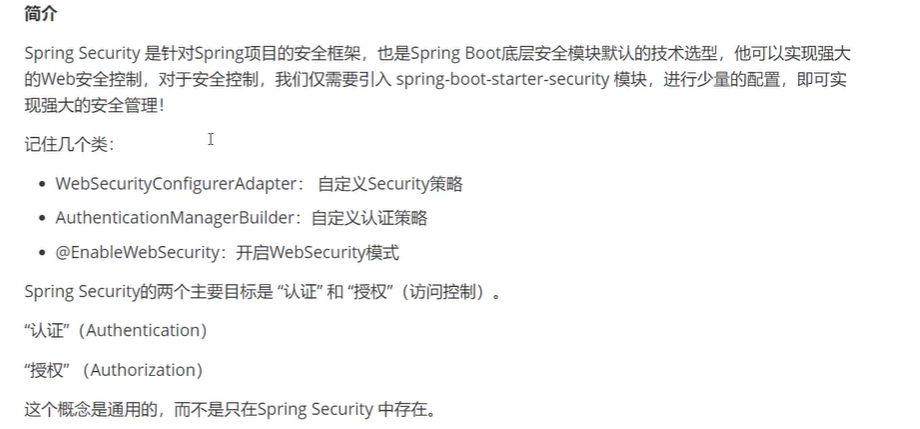
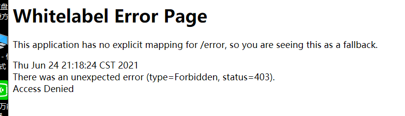

# Spring-security

## 1、配置环境

```xml
<dependency>
    <groupId>org.springframework.security</groupId>
    <artifactId>spring-security-web</artifactId>
</dependency>
```

## 2、简介



```xml
<dependency>
    <groupId>org.springframework.boot</groupId>
    <artifactId>spring-boot-starter-security</artifactId>
</dependency>
```

> Spring Boot的安全Starter

## 3、趁热使用

创建一个配置类

```java
//使用aop
@EnableWebSecurity
public class SecurityConfig extends WebSecurityConfigurerAdapter {
    @Override
    protected void configure(HttpSecurity http) throws Exception {
        //首页所有人可以访问，功能页只有对应有权限的人才能访问
        http.authorizeRequests()
            //里面写Controller的路由地址
                .antMatchers("/").permitAll()
                .antMatchers("/level1/**").hasRole("vip1")
                .antMatchers("/level2/**").hasRole("vip2")
                .antMatchers("/level3/**").hasRole("vip3");
        //自动跳转到登录页面
        http.formLogin();
        //注销
        http.logout();
    }
}

```

当访问http://localhost:8080/level1/1时，会返回一个拒绝访问页面，Access Denied




```java
//认证功能
//Spring Security5.0+新增了很多的加密方法
@Override
protected void configure(AuthenticationManagerBuilder auth) throws Exception {
    //这些数据正常应该从数据库中读
    auth.inMemoryAuthentication().passwordEncoder(new BCryptPasswordEncoder())
            .withUser("wenwen").password(new BCryptPasswordEncoder().encode("123456")).roles("vip1","vip2")
            .and()
            .withUser("root").password(new BCryptPasswordEncoder().encode("123456")).roles("vip1","vip2","vip3")
            .and()
            .withUser("guest").password(new BCryptPasswordEncoder().encode("123456")).roles("vip1");
}
```