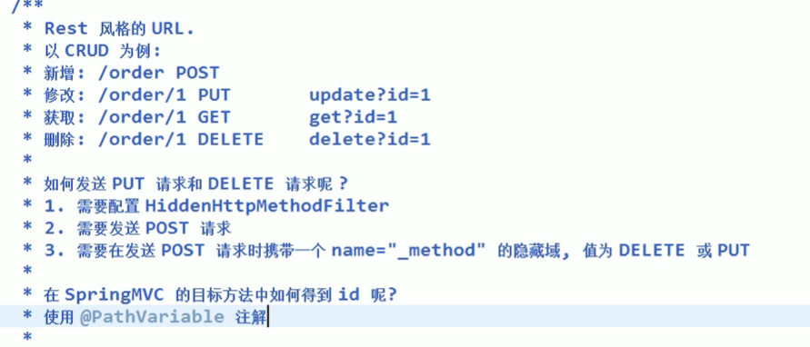
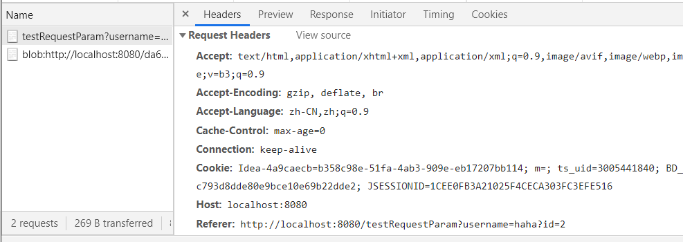
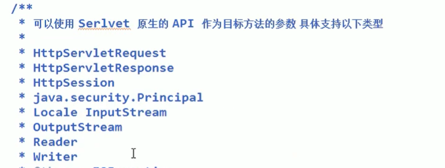

# Spring-MVC

## 1.HelloWorld

### 1.导入所需的依赖

```xml
<dependencies>
  <dependency>
    <groupId>commons-logging</groupId>
    <artifactId>commons-logging</artifactId>
    <version>1.1.3</version>
  </dependency>
  <dependency>
    <groupId>org.springframework</groupId>
    <artifactId>spring-aop</artifactId>
    <version>5.1.10.RELEASE</version>
  </dependency>
  <dependency>
    <groupId>org.springframework</groupId>
    <artifactId>spring-beans</artifactId>
    <version>5.1.10.RELEASE</version>
  </dependency>
  <dependency>
    <groupId>org.springframework</groupId>
    <artifactId>spring-context</artifactId>
    <version>5.1.10.RELEASE</version>
  </dependency>
  <dependency>
    <groupId>org.springframework</groupId>
    <artifactId>spring-core</artifactId>
    <version>5.1.10.RELEASE</version>
  </dependency>
  <dependency>
    <groupId>org.springframework</groupId>
    <artifactId>spring-expression</artifactId>
    <version>5.1.10.RELEASE</version>
  </dependency>
  <dependency>
    <groupId>org.springframework</groupId>
    <artifactId>spring-web</artifactId>
    <version>5.1.10.RELEASE</version>
  </dependency>
  <dependency>
    <groupId>org.springframework</groupId>
    <artifactId>spring-webmvc</artifactId>
    <version>5.1.10.RELEASE</version>
  </dependency>
    <dependency>
      <groupId>org.springframework</groupId>
      <artifactId>spring-aop</artifactId>
      <version>5.1.10.RELEASE</version>
    </dependency>    
</dependencies>
```

### 2.配置web.xml

> 配置DispatcherServlet,对浏览器发送的请求统一进行处理

```xml
<!DOCTYPE web-app PUBLIC
 "-//Sun Microsystems, Inc.//DTD Web Application 2.3//EN"
 "http://java.sun.com/dtd/web-app_2_3.dtd" >

<web-app>
  <servlet>
    <servlet-name>springDispatcherServlet</servlet-name>
    <servlet-class>org.springframework.web.servlet.DispatcherServlet</servlet-class>
<!--    <init-param> 配置DispatcherServlet的一个初始化参数：配置SpringMVC配置文件和名称-->
      
    <init-param>
      <param-name>contextConfigLocation</param-name>
      <param-value>classpath:springmvc.xml</param-value>
    </init-param>
    <load-on-startup>1</load-on-startup> //优先加载
  </servlet>
  <servlet-mapping>
    <servlet-name>springDispatcherServlet</servlet-name>
    <url-pattern>/</url-pattern>
      <!-- 
			设置springMVC的核心控制器所能处理的请求的请求路径
			“/”所匹配的请求可以是/login或.html或.js或.css方式的请求路径
			但是"/"不能匹配.jsp请求路径的请求
		-->
  </servlet-mapping>
</web-app>
```

> 

### 3.配置springmvc.xml配置文件

```xml
<?xml version="1.0" encoding="UTF-8"?>
<beans xmlns="http://www.springframework.org/schema/beans"
       xmlns:xsi="http://www.w3.org/2001/XMLSchema-instance"
       xmlns:context="http://www.springframework.org/schema/context"
       xsi:schemaLocation="http://www.springframework.org/schema/beans http://www.springframework.org/schema/beans/spring-beans.xsd
                        http://www.springframework.org/schema/context http://www.springframework.org/schema/context/spring-context.xsd">
	<!--开启组件扫描-->
    <context:component-scan base-package="com.wenwen.springmvc"/>

<!--    配置视图解析器：如何把handler方法放回值解析为实际的物理视图-->
    <bean class="org.springframework.web.servlet.view.InternalResourceViewResolver">
        <property name="prefix" value="/WEB-INF/views/"/>
        <property name="suffix" value=".jsp"/>
    </bean>

</beans>
```

### 4.配置Controller

```java
@Controller
public class HelloWorld {
    //1.@RequestMapping来映射请求的URL
    
    //2.返回值会通过视图解析器为实际的物理视图，对于InternalResourceViewResolver视图解析，
    //会做如下的解析：通过prefix + returnVal +suffix这样的方式得到实际的物理视图，然后会做转发操作
    ///WEB-INF/views/hello.jsp
    
    @RequestMapping("/helloWorld")
    public String hello(){
        System.out.println("hello world");
        return "hello";
    }
}
```

### 5.创建/WEB-INF/views/hello.jsp文件

### 6.创建index.js文件

```html
<a href="helloWorld">点击</a>
```

## 2.@RequestMapping注解

### 1、注解定义处

- `@RequestMapping`除了修饰方法，还可来修饰类
- 定义处
  - 定义在类上面：提供初步的请求映射信息，相对于WEB应用的根目录。
  - 定义在方法上：提供进一步的细分映射信息。
  - 若类上没有定义`@RequestMapping`，则方法处标记的URL相对于WEB应用的根目录。

### 2、使用属性指定请求参数

使用`method`属性来指定请求方式

​	RequestMethod是一个枚举类

```java
@RequestMapping(value = "/postMethod",method = RequestMethod.POST)
    public String postMethod(){
        return "hello";
    }
```

> 使用GET请求无效，只能用method指定的请求方式

### 3、@PathVariable注解

`@PathVariable`可以来映射URL中的占位符到目标方法的参数中。

```java
@RequestMapping("/testPathVariable/{id}")
public String testPathVariable(@PathVariable("id") Integer id){
    System.out.println("testPathVariable"+id);
    return "hello";
}
```

jsp页面

```html
<a href="/testPathVariable/1">testPathVariable</a>
```

### 4、RestFul风格



配置web.xml

```xml
<!--配置org.springframework.web.filter.HiddenHttpMethodFilter  可以把POST请求转为DELETE或POST请求-->
  <filter>
    <filter-name>HiddenHttpMethodFilter</filter-name>
    <filter-class>org.springframework.web.filter.HiddenHttpMethodFilter</filter-class>
  </filter>
  <filter-mapping>
    <filter-name>HiddenHttpMethodFilter</filter-name>
    <url-pattern>/*</url-pattern>
  </filter-mapping>
```

编写controller

```java
@RequestMapping(value = "/testRestDelete/{id}",method = RequestMethod.DELETE)
public String testRestDelete(@PathVariable("id") Integer id){
    System.out.println("testRestDelete:"+id);
    return "hello";
}

@RequestMapping(value = "/testRestPut/{id}",method = RequestMethod.PUT)
public String testRestPut(@PathVariable("id") Integer id){
    System.out.println("testRestPut:"+id);
    return "hello";
}

@RequestMapping(value = "/testRestPost/{id}",method = RequestMethod.POST)
public String testRestPost(@PathVariable("id") Integer id){
    System.out.println("testRestPost:"+id);
    return "hello";
}

@RequestMapping(value = "/testRestGet/{id}",method = RequestMethod.GET)
public String testRestGet(@PathVariable("id") Integer id){
    System.out.println("testRestGet:"+id);
    return "hello";
}
```

编写前端页面

```html
<a href="/testRestGet/1">testRestGet</a>
<form action="/testRestPost/2" method="post">
    <input type="submit" value="post">
</form>
<form action="/testRestPut/3" method="post" >
    <input type="hidden" name="_method" value="PUT" >
    <input type="submit" value="put">
</form>
<form action="/testRestDelete/4" method="post">
    <input type="hidden" name="_method" value="DELETE">
    <input type="submit" value="delete">
</form>
```

如果报405错误，在跳转页面的jsp头那里加入`isErrorPage="true"`

### 5、@RequestParam注解

1、编写Controller

```java
@RequestMapping("/testRequestParam")
public String testRequestParam(@RequestParam(value = "username") String username,
                               @RequestParam(value = "id",required = false,defaultValue = "0" ) int id){
    System.out.println("username:"+username+" ,id="+id);
    return "hello";
}
```

> @RequestParam来映射请求参数
>
> value值：既请求参数的参数名
>
> required: 该参数是否必须存在，默认为true
>
> defaultValue :请求参数的默认值

2、编写前端页面

```html
<a href="/testRequestParam?username=haha?id=2">RequestParam</a>
```

### 6、@RequestHeader、@RequestCookie

`@RequestHeader`：映射请求头信息

1、编写Controller

```java
@RequestMapping("/testRequestHeader")
public String testRequestHeader(@RequestHeader(value = "Accept-Language") String info){
    System.out.println("Accept-Language:"+info);
    return "hello";
}
```

2、编写前端页面

```html
<a href="/testRequestHeader">testRequestHeader</a>
```

3、对比请求头里的信息




> value属性名可以写Request Headers里的属性


`@RequestCookie`：映射一个Cooke值，用法跟上面一样。

## 3.Controller方法参数值

### 1、使用POJO对象绑定请求参数值

> ​	SpringMVC会按请求参数名和POJO属性名进行自动匹配，自动为该对象
>
> 填充属性值。支持级联属性。如：dept.deptId、dept.address.tel

事例：

1、编写pojo

```java
public class User {
    private String username;
    private String age;
    private int sex;
    private Address address;
    //省略get、set、tostring
```

```java
public class Address {
    private String info;
    private String id;
    //省略get、set、tostring
```

2、编写Controller

```java
@RequestMapping("/testPojo")
public String testPojo(User user){
    System.out.println(user);
    return "hello";
}
```

3、编写前端页面

```html
<form action="/testPojo" method="post">
    username:<input type="text" name="username">
    age:<input type="text" name="age">
    sex:<input type="text" name="sex">
    address:<input type="text" name="address.info">
    <input type="submit" value="提交">
</form>
```

### 2、Servlet原生api



## 4.处理模型数据

有五种方式向request域对象共享数据

servletApi（不建议）、ModelAndView、Model、map、ModelMap

### 1.ModelAndView

1、编写Controller

```java
@RequestMapping("/testModelAndView")
public ModelAndView testModelAndView(){
    ModelAndView modelAndView = new ModelAndView("hello");
    //添加模型数据到ModelAndView里
    modelAndView.addObject("time", new Date());
    return modelAndView;

}
```

> 目标方法的返回值可以是ModelAndView类型
>
> 其中可以包含视图和模型信息
>
> SpringMVC会把ModelAndView的model中数据放到request域对象中。

2、编写前端页面

```html
//首页
<a href="/testModelAndView">testModelAndView</a>
```

```html
//跳转到的页面
<%@ page contentType="text/html;charset=UTF-8" language="java" isErrorPage="true" isELIgnored="false" %>
time:${requestScope.time}
```

### 2.Map

1、编写Controller

```java
@RequestMapping("/testMap")
public String testMap(Map<String,Object> map){
    map.put("names", Arrays.asList("tom","red","blue"));
    return "hello";
}
```

> 目标方法可以添加Map类型（实际上也可以是Model类型或ModelMap类型）的参数

2、编写前端页面

```html
<a href="/testMap">testMap</a>
```

跳转过去的页面

```html
map:${requestScope.names}
```


### 3.@SessionAttributes

> 

1、编写controller

```java
@SessionAttributes(value = {"user"},types = {String.class})
@Controller
public class HelloWorld {
    
    @RequestMapping("/testSessionAttributes")
    public String testSessionAttributes(Map<String,Object>map){
        User user = new User("Tom","222",1,null);
        map.put("user",user);
        map.put("school","string来的哦");
        return "hello";
    }    
```

> @SessionAttributes除了可以通过属性名指定需要放到会话中的属性外（实际上使用的是
>
> value属性值），还可以通过模型属性的对象类型指定哪些模型属性需要放到会话中（实际上使用的是Types属性）
>
> 注意：这个注解只能放在类的上面，而不能放在方法的上面

2、前端页面

```html
<a href="/testSessionAttributes">testSessionAttributes</a>
```

跳转到的展示页面

```html
session:${sessionScope.user}
session:${sessionScope.school}
```


4.ModelAttribute