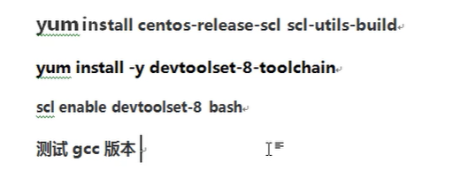
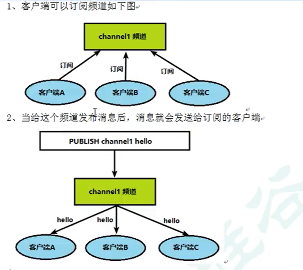

# Redis

## 一、入门

### 1、去官网redis.io下载redis压缩包

### 2、安装C语言的编译环境

### 3、把包放入Linux系统里面

1``使用Xshell连接虚拟机，然后使用rz命令进行上传文件

2`	tar -zxvf redis-xxx`解压文件

3``解压完成后进入解压完后的文件目录，在目录下执行make命令（将redis文件进行编译）

4···使用`make install`命令进行安装

5···安装完成后会在`/usr/local/bin`目录里有redis文件

### 4、设置Redis后台启动

1··打开压缩完成后的redis目录

2··`cp redis.conf /myredis`    把这个文件复制到自己的文件夹里比如/myredis

3··然后改`/myredis/redis.conf` 里的daemonize no 改成yes

4··进入`/myredis/redis.conf` 启动redis

5··启动redis命令：`cd /usr/local/bin` -->`redis-server /myredis/redis.conf` 

6··`ps -ef | grep redis` 命令查看启动Redis是否成功

> redis-cli客户端方式访问redis
>
> redis-cli shutdown 关闭redis

### 5、介绍Redis相关知识

1、Redis端口为6379

2、默认16个数据库，数组下标从0开始，**初始默认使用0号库**

3、切换数据库时，使用命令`select` <某个下标>。如:select 1

4、统一密码管理，所有库的密码都是一样的。

5、Redis是单线程+多路IO复用技术

## 二、常用五大数据类型

### 2.1 Redis键（Key）

#### **常见命令**

`keys *`

> 查看当前库所有的key

`exists key`

> 判断某个key是否存在

`type key` 

> 查看你的key是什么类型

`del key`

> 删除指定的key数据

`unlink key` 根据value选择非阻塞删除（看起来跟上面del key删除一样）

> 仅将keys从keyspace元数据中删除，真正的删除会在后续异步操作

`expire key 10`

> 给这个key设置过期时间为10秒钟

`ttl key`

> 查看还有多少秒过期，-1表示永不过期，-2表示已过期

select

> 命令切换数据库

dbsize

> 查看当前数据库key的数量

flushdb

> 清空当前库

flushall

> 通杀全部库

### 2.2 Redis字符串（String）

#### **常见命令**

set <key><value>

> 添加键值对

get <key>

> 查询对应键值

append <key><value>

> 将给定的<value>追加到原值的末尾

strlen<key>

> 获得值得长度

setnx <key><value>

> 只有在key不存在时 设置key的值

incr <key>

> 将key中存储的数字值增1
>
> 只能对数字值操作，如果为空，新增值为1

decr<key>

> 将key中存储的数字值减1
>
> 只能对数字值操作，如果为空，新增值为-1

incrby/decrby<key><步长>

> 将key中储存的数字值增减。自定义步长。

mset <key1><value><key2><value>......

> 同时设置一个或多个key-value对

mget <key1><key2><key3>

> 同时获取一个或多个value

msetnx<key1><value1><key2><value2>

> 同时设置一个或多个key-value对，只有所有设置key不存在才成功
>
> 具有原子性，有一个失败则都失败

getrange<key><startIndex><endIndex>

> 获得值的范围，类似java中的sbustring
>
> 例子：getrange<k1><0><3>

setrange<key><startIndex><value>

> 用<value>重写<key>所存储的字符串值，从<startIndex>开始（索引从0开始）

setex<key><过期时间><value>

> 设置键值的同时，设置过期时间，单位秒。

getset<key><value>

> 获得旧的值，然后给key设置新的值<value>

### 2.3 Redis列表（List）

#### 2.3.1简介

单键多值

Redis列表是最简单的字符串列表，按照插入顺序排序。你可以添加一个元素到列表的头部（左边）或者尾部（右边）。

他的底层实际是个双向链表，对两端的操作性能很高，通过索引下标的操作中间的结点性能会较差。

#### 2.3.2常用命令

lpush/rpush <key><value1><value2><value3>....

> 从左边/右边插入一个或多个值。

lpop/rpop <key>

> 从左边/右边吐出一个值。值在键在，值光键光。

rpoplpush<key1><key2>

> 从<key1>列表右边吐出一个值，插到<key2>列表左边

lrange<key><start><stop>

> 按照索引下标获得元素（从左到右）

lrange mylist 0 -1 

> 0左边第一个，-1右边第一个，（0-1表示获取所有）

lindex<key><index>

> 按照索引下标获得元素（从左到右）

llen<key>

> 获得列表长度

linsert<key> before <value><newvalue>

> 在<value>的后面插入<newvalue>插入值

lrem<key><n><value>

> 从左边删除n个value(从左到右)

lset<key><index><value>

> 将列表key下标为index的值替换成value

#### 2.3.3数据结构

​	List的数据结构为快速链表quickList.

​	首先在列表元素较少的情况下会使用一块连续的内存存储，这个结构是**ziplist**,也既是

压缩列表。

​	它将所有的元素紧挨着一起存储，分配的是一块连续的内存。

​	**当数据量比较多的时候才会改成quicklist**。

​	因为普通的链表需要的附加指针空间太大，会比较浪费空间。比如这个列表里存的只是

int类型的数据，结构上还需要两个额外的指针prev和next。

### 2.4 Redis集合（Set）

#### 2.4.1 简介

​	Redis set对外提供的功能与list类似是一个列表的功能，特殊之处在于set是可以自动

排重的，当你需要存储一个列表数据，又不希望出现重复数据时，set是一个很好的选择。

​	Redis的Set是string类型的无序集合。它底层其实是一个value为null的hash表，所以添加

删除，查找的复杂度都是0（1）。

#### 2.4.2 常用命令

​	sadd<key><value1><value2>....

> 将一个或多个member元素加入到集合key中，已经存在的member元素将被忽略

​	smembers<key>

> 取出该集合的所有值。

​	sismember<key><value>

> 判断集合<key>是否为含有该<value>值，有的话为1，没有的话为0

​	scard<key>

> 返回该集合的元素个数

​	srem<key><value1><value2>...

> 删除集合中的某个元素

​	spop<key>

> 随机从该集合中吐出一个值

​	srandmember<key><n>

> 随机从该集合中取出n个值。不会从集合中删除

​	smove<source><destination><value>

> 把集合中一个值从一个集合移动到另一个集合

​	sinter<key1><key2>

> 返回两个集合的交集元素。

​	sunion<key1><key2>

> 返回两个集合的并集元素

​	sdiff<key1><key2>

> 返回两个集合的差集元素(key1中有的，key2中没有的)

### 2.5 Redis哈希(Hash)

#### 2.5.1 简介

Redis hash是一个string类型的field和value映射表，hash特别适用于存储对象。

类似java里面的Map<String,Object>

#### 2.5.2 常用命令

hset<key><field><value>

> 给<key>集合中的<field>键赋值<value>

hget<key1><field>

> 从<key1>集合<field>取出value

hmset<key1><field1><value1><field2><value2>...

> 批量设置hash的值

hexists<key1><field>

> 查看哈希表key中，给定域field是否存在

hkeys<key>

> 列出该hash集合的所有field

hvals<key>

> 列出该hash集合的所有value

hincrby<key><field><increment>

> 为哈希表key中的域field的值加上增量 1或者 -1

hsetnx<key><field><value>

> 将哈希表 key中的域field的值设置为value,当且仅当域field不存在

#### 2.5.3 数据结构

​	Hash类型对应的数据结构是两种：ziplist(压缩列表)，hashtable(哈希表)。

当field-value长度较短且个数较少时，使用ziplist,否则使用hashtable。

### 2.6 Redis有序集合Zset(sorted set)

#### 2.6.1	简介

​	Redis有序集合zset与普通集合set非常相似，是一个没有重复元素的字符串集合。

不同之处是有序集合的每个成员都关联了一个**评分(scope)**,这个评分(score)被用来按照

​	从最低分到最高分的方式排序集合中的成员。集合的成员是唯一的，但是评分可以是重复了。

​	因为元素是有序的，所以你也可以很快的根据评分(score)或者次序(position)来获取一个范围的元素。访问有序集合的中间元素也是非常快的，因此你能够使用有序集合作为一个没有重复成员的只能列表。

#### 2.6.2 常用命令

zadd<key><score1><value1><score2><value2>...

> 将一个或多个member元素及其score值加入到有序集key当中。

zrange<key><start><stop>[WITHSCORES]

> 返回有序集key中，下标在<start><stop>之间的元素
>
> 带WITHSCORES,可以让分数一起和值返回到结果集

zrangebyscore key minmax [withscores] [limit offset count]

> 返回有序集key中，所有score值介于min和max之间（包括等于min或max）的成员。
>
> 有序集成员按score值递增（从小到大）次序排列

zrevrangebyscore key maxmin [withscores] [limit offset count]

> 同上，改为从大到小排列

zincrby<key><increment><value> 

> 为元素的score加上增量

zrem<key><value>

> 删除该集合下，指定值的元素

zcount<key><min><max>

> 统计该集合，分数区间内的元素个数

zrank<key><value>

> 返回该值在集合中的排名，从0开始

## 三、Redis的发布和订阅

### 3.1 什么是发布和订阅

Redis发布订阅(pub/sub)是一种消息通信模式：发送者(pub)发送消息，订阅者(sub)接收消息。

Redis客户端可以订阅任意数量的频道。

### 3.2 Redis的发布和订阅

1、客户端可以订阅频道如下图

### 3.3 发布订阅命令行实现

1、打开一个客户端订阅channel1

`subscribe channel1`

2、打开另一个客户端向channel1发布消息hello

`publish channel1 hello`

返还命令行的数字1是订阅者数量

3、打开第一个客户端可以看到发送的消息

## 四、Jedis操作Redis6

1、更改redis配置文件

把bind127.0.0.1注释掉，还有把protected-mode 改成no